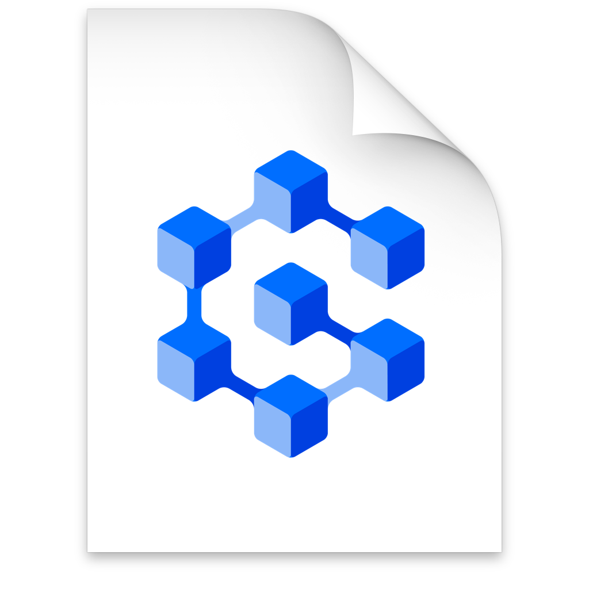

# GreynirCorpus 1.1

 Texti
[á íslensku](#user-content-stór-trjábanki-með-þáttuðum-íslenskum-texta) fyrir neðan.

### A large treebank of parsed Icelandic text

**GreynirCorpus** is a large, parsed treebank of modern Icelandic text.

The treebank consists of **10 million parsed sentences** containing approximately 140 million words.
The sentences were parsed mechanically using the [Greynir](https://github.com/mideind/GreynirPackage)
rule-based parser. The text was extracted from news and government sites on the web in the years
2015-2021 and parsed into full constituency trees in flat text format. The format is similar to that of
the [Penn Treebank](http://citeseerx.ist.psu.edu/viewdoc/download?doi=10.1.1.9.8216&rep=rep1&type=pdf) and
[The Icelandic Parsed Historical Corpus (IcePaHC)](https://linguist.is/icelandic_treebank/Icelandic_Parsed_Historical_Corpus_(IcePaHC)).

The treebank is published under the
[**Creative Commons CC-BY 4.0 license**](https://creativecommons.org/licenses/by/4.0/)
and is thus open and free for general use, with attribution.

The treebank has four parts:

1. A **copper standard** corpus of 10 million mechanically parsed and shuffled sentences.
   This treebank is contained in ten gzip-compressed files in the [`psd/copper`](psd/copper)
   directory, each containing one million sentences. Each file is about 200 MB in compressed
   form and about 1.3 GB uncompressed.
   Foreign sentences, unparsed sentences, and uncapitalized sentences were excluded from the corpora.

2. A **silver standard** corpus of 600 thousand *unique* mechanically parsed sentences selected
   based on various grammatical attributes. Found in the [`psd/silver`](psd/silver) directory.
   Sentences were picked based on their ability to provide enough information for fine-tuning a neural
   parser. In addition to exclusions in the copper standard, sentences beyond 500,000 were only added
   if they contained new information after normalization or the parse trees contained rare terminals
   or non-terminals.

3. A **gold standard** corpus of 5,000 parsed sentences that have been manually corrected
   and verified. The gold standard is split into a test set, containing 500 sentences, 
   and a development set, containing 4,500 sentences, located in [`testset/psd/`](testset/psd)
   and [`devset/psd`](devset/psd), respectively. Each text file contains 10 manually
   annotated sentences. The sentences tend to get longer with higher file numbers.
  
4. **Extra** corpora, such as headings and short sentences under 5 tokens.
   These are contained in the [`extra/`](extra/) directory.
   The heading corpora contain 531,855 parsed sentences.
   The short corpora contain 1,652,938 parsed sentences.

Mechanically parsed sentences were parsed using
[Greynir v3.1.0](https://github.com/mideind/GreynirPackage/releases/tag/3.1.0) and
[Tokenizer v3.1.1](https://github.com/mideind/Tokenizer/releases/tag/3.1.0).

An adapted version of [**Annotald**](https://github.com/mideind/Annotald) can be used to work
with the files.

A [**test suite**](https://github.com/mideind/ParsingTestPipe) using the gold standard test
set to measure the performance of the Greynir parser has been developed.

The annotation scheme is described extensively in this 60-page
[guideline document](https://github.com/mideind/GreynirPackage/blob/master/doc/_static/annotation_instructions.pdf?raw=true)
(Icelandic-language PDF).

**Please note that [git-lfs](https://git-lfs.github.com/) is required to clone this repository.**

GreynirCorpus is a product of [Miðeind ehf.](https://mideind.is), Reykjavík, Iceland,
to which it should be attributed.

Parts of this project were developed under the auspices of the
Icelandic Government's 5-year Language Technology Programme for Icelandic,
managed by [Almannarómur](https://almannaromur.is). The LT Programme is described
[here](https://www.stjornarradid.is/lisalib/getfile.aspx?itemid=56f6368e-54f0-11e7-941a-005056bc530c>)
(English version [here](https://clarin.is/media/uploads/mlt-en.pdf>)).

This project was partially funded by the Icelandic government's
*Strategic research and development programme for language technology*
(*Markáætlun í máltækni*), operated by [Rannís](https://rannis.is).

----------

### Stór trjábanki með þáttuðum íslenskum texta

**GreynirCorpus** er stórt safn af fullþáttuðum texta á nútímaíslensku.

Trjábankinn inniheldur **10 milljónir málsgreina**, u.þ.b. 140 milljónir orða.
Textinn var sóttur á vefsíður fréttamiðla og opinberra aðila á árunum 2015-2021, og
fullþáttaður í setningatré sem geymd eru í flötu textaformi. Gagnaformið er svipað og í
[Penn Treebank](http://citeseerx.ist.psu.edu/viewdoc/download?doi=10.1.1.9.8216&rep=rep1&type=pdf) og
[The Icelandic Parsed Historical Corpus (IcePaHC)](https://linguist.is/icelandic_treebank/Icelandic_Parsed_Historical_Corpus_(IcePaHC)).

Trjábankinn er gefinn út undir 
[**Creative Commons CC-BY 4.0 leyfi**](https://creativecommons.org/licenses/by/4.0/)
og er þannig opinn og frjáls til afnota, sé uppruna getið.

Trjábankinn er í fjórum hlutum:

1. **Koparstaðall**, 10 milljón málsgreinar, stokkaðar í handahófskennda röð og vélþáttaðar.
   Þessi hluti trjábankans er geymdur í tíu skrám í [`psd/copper`](psd/copper) möppunni. Hver skrá er
   um 200 megabæti í þjöppuðu formi og u.þ.b. 1,3 gígabæti óþjöppuð.
   Erlendar setningar, óþáttaðar setningar og setningar sem hefjast á lágstaf voru undanskildar.

2. **Silfurstaðall**, 600 þúsund *einstakar*, stokkaðar og vélþáttaðar málsgreinar valdar út frá
  margvíslegum málfræðilegum eiginleikum. Trjábanka þennan má finna í [`psd/silver`](psd/silver)
  möppunni. Setningar voru valdar sem veittu nægar upplýsingar fyrir fínþjálfun taugaþáttara.
  Auk takmarkana frá koparstaðlinum voru setningar umfram 500 þúsund aðeins teknar með ef þær
  innihéldu nýjar upplýsingar eftir textastöðlun eða þáttunartrén innihéldu fátíð lauf eða liði.

3. **Gullstaðall** sem samanstendur af 2.610 málsgreinum og þáttunartrjám þeirra, sem hafa
   verið handyfirfarin og leiðrétt. Gullstaðallinn skiptist í [prófunarmengi](testset/psd),
   sem inniheldur 500 setningar, og [þróunarmengi](devset/psd), sem inniheldur 4.500 setningar.
   Hver textaskrá inniheldur 10 handþáttaðar málsgreinar. Málsgreinarnar eru almennt lengri
   eftir því sem skrárnúmer hækka.

4. **Aukagögn**, sem eru geymd í [`extra/`](extra/) möppunni.
   Fyrirsagnasafnið inniheldur 531.855 þáttaðar setningar.
   Safn stuttra setninga inniheldur 1.652.938 þáttaðar setningar.

Vélþáttaðar setningar voru þáttaðar með
[Greyni útgáfu 3.1.0](https://github.com/mideind/GreynirPackage/releases/tag/3.1.0) og
[Tokenizer útgáfu 3.1.1](https://github.com/mideind/Tokenizer/releases/tag/3.1.0).

Þáttunarskemanu er ýtarlega lýst í þessu 60 síðna 
[leiðbeiningarskjali (PDF)](https://github.com/mideind/GreynirPackage/blob/master/doc/_static/annotation_instructions.pdf?raw=true).

Uppfærð útgáfa af [**Annotald**](https://github.com/mideind/Annotald) er notuð til að vinna
með skjölin.

[**Prófunarsvíta**](https://github.com/mideind/ParsingTestPipe) var þróuð sem notar
gullprófunarmengið til að mæla árangur Greynisþáttarans.

**Git-afritun á kóðasafninu krefst [git-lfs](https://git-lfs.github.com/).**

GreynirCorpus er gefinn út á vegum [Miðeindar ehf.](https://mideind.is), Reykjavík,
sem geta skal sem útgefanda þegar gögnin eru notuð skv. CC-BY 4.0 leyfinu.

Verkefnið naut styrks úr *Markáætlun í máltækni* á vegum [Rannís](https://rannis.is).

Hlutar safnsins voru þróaðir undir hatti 5 ára máltækniáætlunar ríkisins.
[Almannarómur](https://almannaromur.is) sér um framkvæmd áætlunarinnar. Áætluninni er lýst
[hér](https://www.stjornarradid.is/lisalib/getfile.aspx?itemid=56f6368e-54f0-11e7-941a-005056bc530c>)
(ensk útgáfa [hér](https://clarin.is/media/uploads/mlt-en.pdf>))
